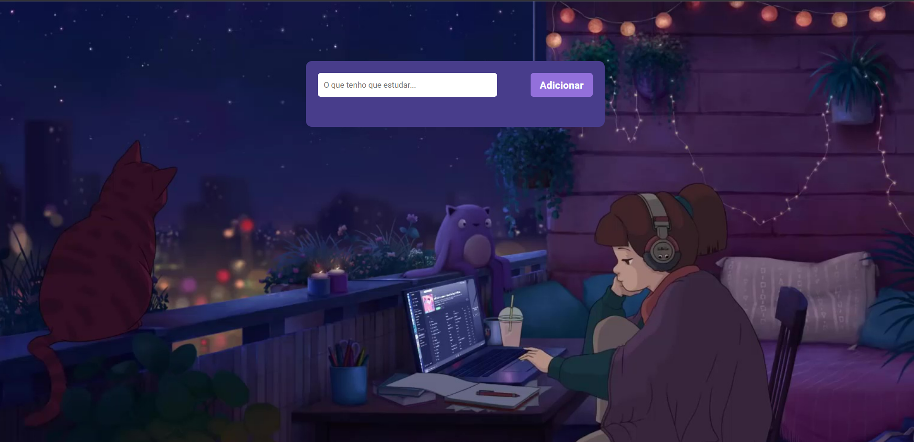
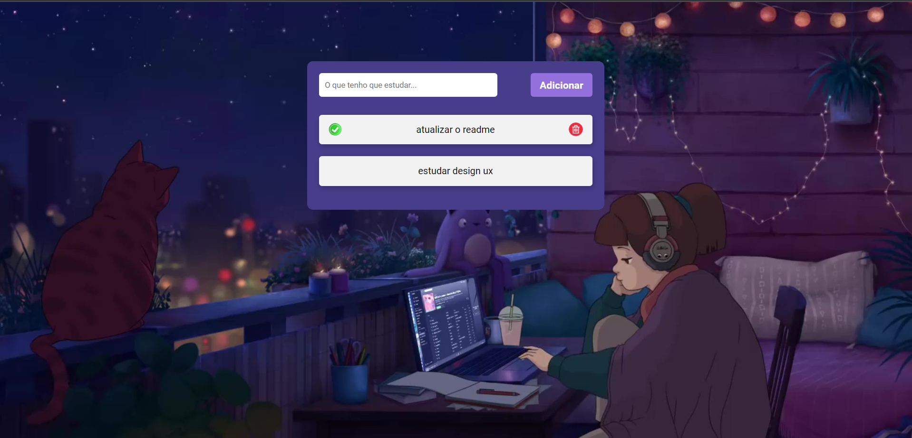

# todolist
[](https://github.com/Rayane-Souza/todolist/blob/main/LICENSE)

## ✅ Sobre o Projeto

[todolist-rayane-souza.vercel.app](https://todolist-rayane-souza.vercel.app/)

Bem-vindo ao ToDoList, uma aplicação simples para ajudar você a organizar suas tarefas diárias.
Na aplicação é possível remover aquelas já feitas, e também adicionar novas atividades. 

## 🔗 Layout





## 💻 Tecnologia utilizadas
### Front End 
&nbsp; &nbsp;&nbsp;


## 📌 Como executar o projeto
```
# clonar o repositório
git clone https://github.com/Rayane-Souza/todolist.git

# Entrar na pasta
 cd todolist

# Abra o projeto no navegador
clicando com o botão direito no arquivo HTML e selecionando "Abrir com" ou "Open with live server"
``` 

## Autora
Rayane Souza

<a href="https://www.linkedin.com/in/rayanekelly/" target="_blank"></a>